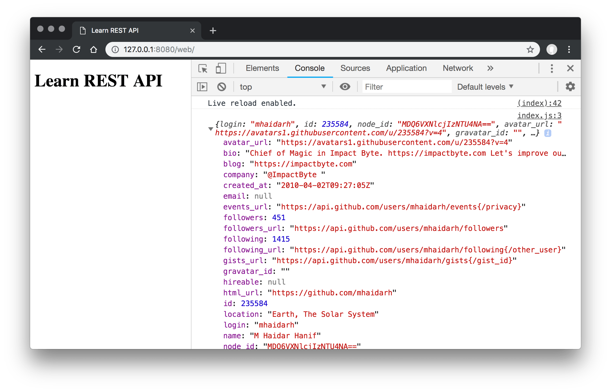

# Learn REST API

## In Web Browser

```sh
npm start:web
# live-server web
# open in localhost:8080
```

Result:



## In Node.js Server

```sh
yarn start:server
npm run start:server
# node server
```

Result:

```json
{
  "login": "mhaidarh",
  "id": 235584,
  "node_id": "MDQ6VXNlcjIzNTU4NA==",
  "avatar_url": "https://avatars1.githubusercontent.com/u/235584?v=4",
  "gravatar_id": "",
  "url": "https://api.github.com/users/mhaidarh",
  "html_url": "https://github.com/mhaidarh",
  "type": "User",
  "site_admin": false,
  "name": "M Haidar Hanif",
  "company": "@ImpactByte ",
  "blog": "https://impactbyte.com",
  "location": "Earth, The Solar System",
  "email": null,
  "hireable": null,
  "bio": "Chief of Magic in Impact Byte. https://impactbyte.com Let's improve our life, work, tech, and education altogether.",
  "public_repos": 132,
  "public_gists": 7,
  "followers": 451,
  "following": 1415,
  "created_at": "2010-04-02T09:27:05Z",
  "updated_at": "2019-02-15T06:06:51Z"
}
```
